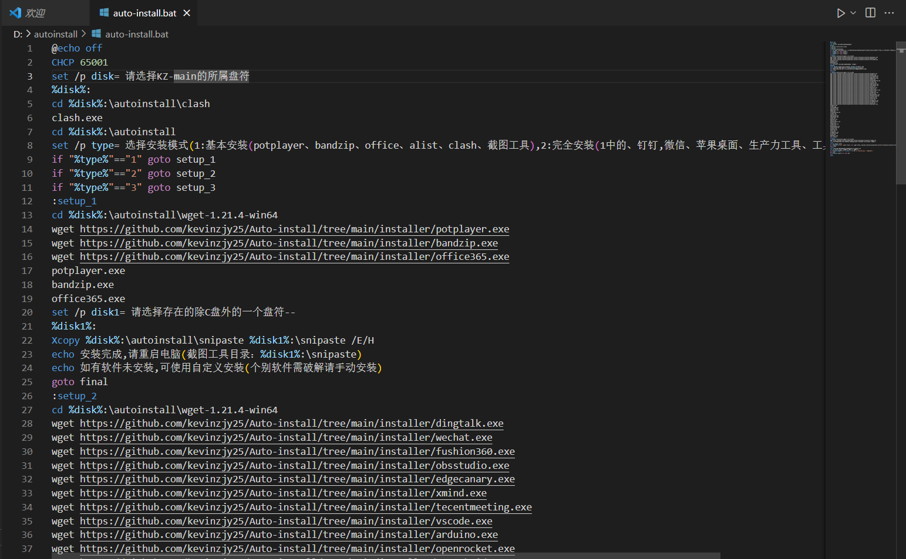
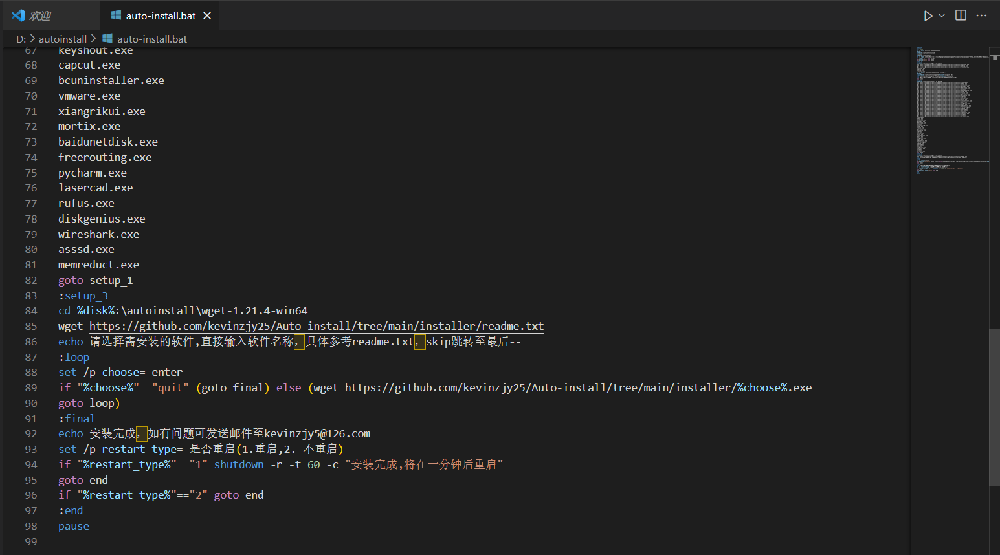
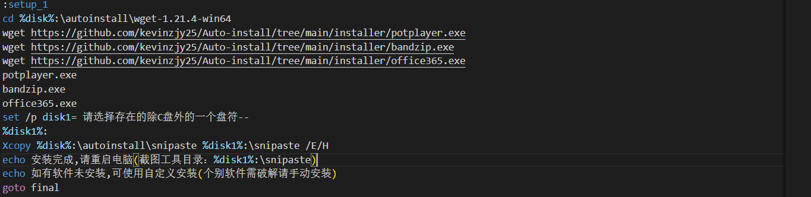
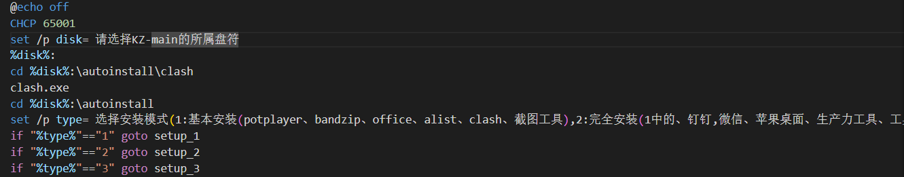

# Auto-install-A useful installer 

>**video:**
>
>bilibili:
>
>youtube:

### Code description：

First,the programming language used in this script is Batch. The main reason for using this language is that the necessary environment for languages ​​such as Python is not installed on most computers that need to be installed. Batch is already built into the windows system.

Second,this script has three execution modes:
1.Basic installation,that is, only some basic software is installed. This mode is mainly used for installation on computers that are only used for a short period of time. Specifically, for example, if the laptop's power is not enough to continue using it when you are out, and you need to use someone else's computer to continue working,and then you can use this script.But this mode only installs a few basic software：bandzip,microsoft365,potplayer.

2.Full installation，that is to say, all the software on my current computer will be installed on the target computer, except for some software that is limited by hardware. (For specific software, please refer to the notice)

3.Custom installation，that is, only the software you entered will be installed. After completing the installation once, you can enter the software you need to install again. When you enter quit, the installation can be completed.

### Code comments：

>Turn off automatic return (printing)
>
>Set the Chinese code page to ensure that the display will not be garbled. '65001' is the language number of Simplified Chinese.
>
>Set the variable 'disk' and read the input.'请选择KZ-main的所属盘符' is used to prompt the user what content needs to be entered.‘KZ-main’ is the drive letter where my installation script is located. You can change it according to your own situation.
>
>Switch to the drive letter of the variable disk.For example,you just entered 'D'，then it will locate the D drive.
>
>Go to the \autoinstall\clash directory，and run Clash (a vpn) to ensure that mainland China can also use this script smoothly.(But you need to have a subscription link）
>
>Go to the \autoinstall directory
>
>Set another variable 'type'and read input.Following are instructions for selecting the installation mode.----选择安装模式(1:基本安装(potplayer、bandzip、office、alist、clash、截图工具),2:完全安装(1中的、钉钉,微信、苹果桌面、生产力工具、工具),3:个性化安装)
>
>When the input value of type is 1, jump to the setup_1 label,enter 2 to jump to setup_2,enter 3 to jump to setup_3
>

## Notice：

1.Software that will not be installed in a full installation due to high hardware requirements：davinci reslove,matlab,KSP,FSX,Liftoff.

2.Fully install the software that will be installed:
dingtalk,
wechat,
fushion360,
obsstudio,
edgecanary,
xmind,
tecentmeeting,
vscode,
arduino,
openrocket,
stmcubeide,
mind+,
keyshout,
capcut,
bcuninstaller,
vmware,
xiangrikui,
mortix,
baidunetdisk,
freerouting,
pycharm,
lasercad,
rufus,
diskgenius,
wireshark,
asssd,memreduct.

3.If you have any questions, please send them to:kevinzjy5@gmail.com.

